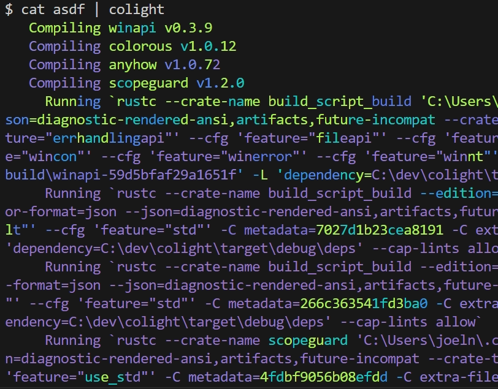

Colight
=======



Command line utility that highlights text based on how compressible it is.
Compressibility is determined using a lz77-like algorithm.
The idea is that compressibility is a good indicator of whether a piece of text is interesting or not.

It only works in true-color terminals.

## Usage

```bash
$ cat file | colight
```

## Installing from source

```bash
cargo install --git https://github.com/jnises/colight
```

## Building

Make sure you have rust installed (https://rustup.rs/)

`cargo build -r`

The resulting binary can be found in `target/release/colight`